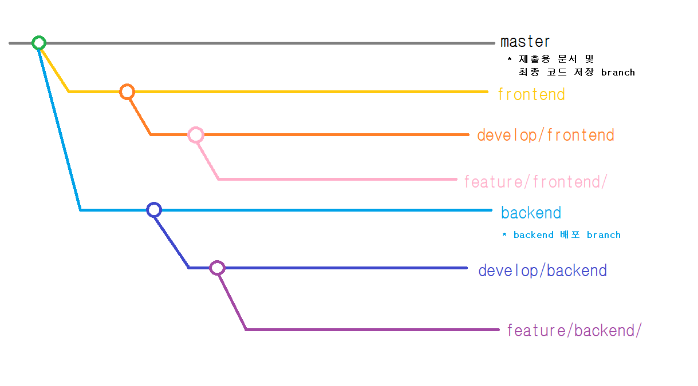

# 자율 프로젝트 A508
## Git
### Git Branch Strategy


### Git Convention
```
Personal_Icon [Category] Summary
- Explanations...

# Categories
* FEAT: 기능 생성 (새로운 기능)
* FIX: 버그 수정
* REFACTOR: 리팩토링
* CHORE: (코드 수정 없는) 설정 변경
* STYLE: 로직 변경 없는 주석, .css 등
* DOCS: 문서 (문서 추가, 수정, 삭제)
```