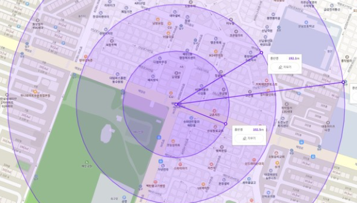
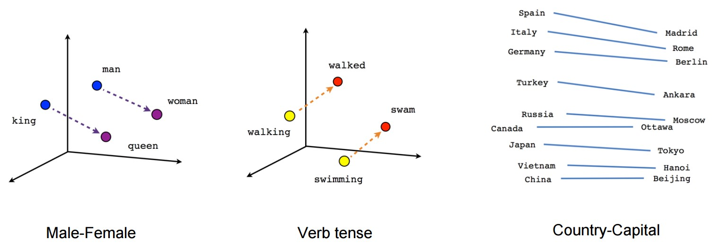

# 1. 서비스 소개

[<h2>▶ MEEPLO 다운로드 링크](https://drive.google.com/file/d/1HmoUB0zm-o00Jh1k6OyBOtnr2NhLr4Yh/view?usp=share_link)

## 서비스 개요

### 프로젝트 진행 기간

- 2022.10.10 ~ 2022.11.21

### 간략 소개

- “어디서 만날지 추천 받고 함께한 기록을 남겨요!”
- 위치 정보를 기반으로 중간 지점을 산출하고, 약속 장소를 추천 받아 약속을 잡을 수 있습니다.
- 함께 찍은 사진을 필름 사진 형태로 기록 남기고 뒷면에 댓글을 작성합니다.

### 서비스명

- Meeplo
  - Meeplo는 영어 단어 Meet, Plan, Log를 합성한 단어로 `만남을 계획하고 기록을 남긴다`는 의미를 담은 서비스명입니다.

## 기획 배경

약속을 잡다 보면 가장 오래 시간을 할애하는 부분이 약속 장소를 정하는 부분입니다. 어디서 만날지, 만나서 무엇을 할 지를 오랫동안 고민하게 됩니다. 그럴 때 만날 사람들의 위치를 기반으로 적절한 중간 지점을 찾아주고, 그 근방에서 사용자의 키워드에 따른 장소를 추천해주면 의사 결정 시간을 줄일 수 있을 것이라 생각해 기획하게 되었습니다.

또 같이 찍은 사진을 카카오톡에서 공유를 하지만 메신저의 특성 상 특정 약속에 대한 사진만을 모아볼 수는 없습니다. 또 다운로드를 받지 않거나 톡서랍 같은 기능을 사용하지 않으면 일정 시간이 지나면 그 사진을 볼 수 없게 됩니다. 그래서 함께한 사람들별로 혹은 약속별로 사진을 모아보면서 아날로그 감성을 살린 사진 기록 형태의 앱을 구성하였습니다.

## 타겟

- 멀리 떨어져 사는 친구들과 어디서 만날지 고민하던 분들
- 필름 사진 같은 아날로그 감성으로 기록을 남기고 싶었던 분들

# 2. 프로젝트 주요 기능

## 그룹

- 그룹 생성

  

- 그룹 참가

  

- 그룹 탈퇴

  

## 약속

- 약속 생성

## 추억

-

# 3. 설계 및 기획 산출물

## ERD

- ERD Cloud Version

  

## API 명세

- [API 명세 문서](./README/API_Spec.md)

- 이미지

  
  

## Figma

- 전체 이미지

  

- 개별 이미지

  - 홈 화면

    

  - 모임 flow

    

  - 약속 flow

    

  - 추천 flow

    

  - 추억 flow

    

  - 마이페이지 flow

    

## Porting Manual

- [Porting Manual.md](./exec/Porting_Manual.md)

# 4. 기술 스택 및 배포 환경

## Client

### Meeplo App

- react-native : `0.70.5`
  - 리액트 네이티브를 사용하여 네이티브 앱으로 빌드
- react-redux : `^8.0.4` @reduxjs/toolkit : `^1.8.6`
  - redux를 사용하여 전역 상태 관리
- react : `18.1.0`
- @react-navigation/native : `^6.0.13`
  - App내 이동을 관리하는 navigation 라이브러리
- aws-sdk : `^2.1245.0`
  - 이미지 저장 용도로 s3와 연동
- axios : `0.27.2`
- react-native-webview : `^11.23.1`
  - 웹으로 구성된 지도를 WebView로 사용하여 App에 포팅하여 사용

### MeeploMap Web

- react : `18.2.0`
- react-kakao-maps-sdk : `^1.1.5`
  - kakao map을 react에서 편하게 사용할 수 있는 sdk 라이브러리
- webpack : `^5.74.0` webpack-cli : `^4.10.0` webpack-dev-server : `^4.11.1`
- @babel/core : `^7.20.0`

## Backend

### Business Logic

- Java : `OpenJDK 11`
- Gradle : `gradle-7.4-bin`
- Spring Boot : `2.7.4`
- Spring security : `2.7.4`
- JPA : `2.7.4`
- Swagger : `3.0.0`
- JWT : `0.9.1`

### Web Scraper

- Java : `OpenJDK 11`
- Spring Boot : `2.7.5`
- JPA : `2.7.5`
- Selenium : `4.5.3`
  - 버튼을 클릭하고 페이지를 이동하는 등의 동적인 환경에서의 크롤링을 위해 사용
- Jsoup : `1.15.3`
  - 동적으로 이미 전부 받아온 html을 빠르게 파싱하기 위해 사용

## Recommendation

### Fast API

- Python : `3.10.8`
- Fast API : `0.87.0`
- Uvicorn : `0.19.0`
- Gensim : `4.2.0`
  - Word2Vec, FastText 사용을 위한 library
- Shapely : `1.8.5`
  - 무게 중심을 찾기 위한 library

## Infrastructure

### Architecture

### Version

- Kubernetes: `1.25.3`
- Jenkins: `2.361.4`
- MySQL : `8.0.31`
- Redis : `7.0.5`

### 특징

- HPA를 사용하여 요청의 수에 따라 서버 인스턴스가 자동으로 증가 및 감소, worker node에 고르게 분배됨
- 특정 서버 인스턴스에서 문제가 발생하여 종료되어도 설정한 수 만큼 자동으로 관리

## Algorithm

### 중간 지점 추천

1. 사용자들의 출발 장소의 위도/경도를 받는다.
2. 사용자로부터 받은 위도/경도에서 Graham Scan 알고리즘을 통해 가장 큰 형태의 convex hull을 만든다.

   

   

3. 생성한 convex hull의 좌표를 모아 무게 중심 좌표를 구한다.

   

4. 3번에서 얻은 무게 중심 좌표를 기반으로 Haversine 알고리즘을 이용하여 직선 거리를 기준으로 가장 가까운 역의 정보를 3개까지 보여준다.

   

### 키워드 추천

1. 미리 확보한 데이터를 토대로 Word2Vec, FastText 모델을 만들어둔다.

   1. 전처리 : Tokenizer(형태소 분석기) 중 Okt를 이용하여 맞춤법을 맞춰준 후, 토큰화, 불용어 제거를 거친다.
   2. Word2Vec

      1. 비슷한 위치에서 등장하는 단어들은 비슷한 의미를 가진다는 가설 이용
      2. 학습된 데이터의 단어를 tokenization한 후, 불용어를 제거하고 각 단어를 벡터화한다.
      3. 단어 간 거리를 기준으로 유사도를 계산하기 때문에 비슷한 의미를 갖는 단어 유사도가 FastText에 비해 신뢰도가 있다.

      

      

      

   3. FastText

      1. Word2Vec 학습 시 없는 데이터에 관해서 추가적으로 키워드 기반 추천을 하기 위해 도입한 모델
      2. 학습된 데이터의 단어들을 tokenization한 후, 해당 단어의 자음, 모음을 분리하여 자, 모음이 비슷한 단어를 추천해준다.
      3. 자, 모음이 비슷한 단어를 추천하기 때문에 Word2Vec보다 유사도 기준을 높게 잡아야 원하는 값을 얻을 수 있다.

      

2. 사용자로부터 받은 키워드와 해당 키워드를 토대로 Word2Vec, FastText 모델을 사용하여 얻은 유사도가 높은 단어를 얻는다.
3. 2번에서 얻은 단어들을 SELECT Query(Like)문을 통해 DB에 존재하는 단어로 바꿔주어 Business Logic에서 바로 사용할 수 있도록 정제한다.

# 5. 커뮤니케이션

## JIRA

- 누적흐름도표

  

- 로드맵

  

## Notion

- 메인

  
  

- 회의록

  

- MEEPLO 도서관

  

- Git 브랜치 전략 & 컨벤션

  

## Git

# 6. 팀원 소개

