# 포팅 매뉴얼

## Client

### 1. Meeplo App

- 버전
  - react-native `0.70.5`
    - 리액트 네이티브를 사용하여 네이티브 앱으로 빌드
  - react-redux `^8.0.4` @reduxjs/toolkit `^1.8.6`
    - redux를 사용하여 전역 상태 관리
  - react `18.1.0`
  - @react-navigation/native `^6.0.13`
    - App내 이동을 관리하는 navigation 라이브러리
  - aws-sdk `^2.1245.0`
    - 이미지 저장 용도로 s3와 연동
  - axios `0.27.2`
  - react-native-webview `^11.23.1`
    - 웹으로 구성된 지도를 WebView로 사용하여 App에 포팅하여 사용
- 설정파일
  <details>
    <summary> .env </summary>

  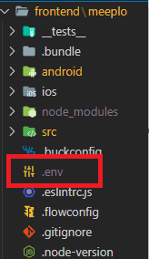

  ```
  MEEPLO_APP_ALBUM_BUCKET_NAME = {이미지가 저장 될 S3 버킷 이름}
  MEEPLO_APP_BUCKET_REGION = {버킷 리전}
  MEEPLO_APP_IDENTITY_POOL_ID = {identity pool id}
  MEEPLO_SERVER_BASE_URL = {api 백엔드 서버 url}
  ```

  </details>

<details>
<summary> 프로젝트 초기 설정 </summary>

_이 문서는 Windows 환경에서 Android앱을 React Native로 개발하기 위한 환경 세팅을 다룹니다._

<aside>

🔗 [https://reactnative.dev/docs/environment-setup](https://reactnative.dev/docs/environment-setup)

</aside>

# 도구 설치

React Native로 Android 앱을 개발하기 위해 **Node.js, JDK, Android Studio** 3가지 도구가 필요합니다.

## Chocolatey

Chocolatey는 Windows 운영체제에서 사용 가능한 패키지 매니저의 일종입니다. 공식 문서는 Node.js와 JDK 설치에 Chocolatey를 사용할 것을 권장하고 있습니다. 따라서 Chocolatey를 우선 설치해야 합니다.

  <aside>

🔗 [https://chocolatey.org/install](https://chocolatey.org/install)

  </aside>

```jsx
// 관리자 권한으로 PowerShell을 실행하고 아래 명령어를 입력하면 설치가 완료됩니다.

Set-ExecutionPolicy Bypass -Scope Process -Force; [System.Net.ServicePointManager]::SecurityProtocol = [System.Net.ServicePointManager]::SecurityProtocol -bor 3072; iex ((New-Object System.Net.WebClient).DownloadString('https://community.chocolatey.org/install.ps1'))
```

### Node.js와 JDK

React Native는 14버전 이상의 Node.js가 필요하며, JDK는 11버전을 사용할 것을 추천하고 있습니다. chocolatey가 정상적으로 설치되었다면 아래 명령어를 통해 모두 설치할 수 있습니다.

```shell
🔗 choco install -y nodejs-lts openjdk11
```

## Android Sutdio

안드로이드 앱 빌드 및 테스트를 위해 몇가지 도구가 필요합니다. Android Studio를 통해 설치가 가능하므로 Android Studio 설치 wizard를 실행하고 아래 Step에 따라 설치를 진행합니다.

<aside>

🔗 [https://developer.android.com/studio/index.html](https://developer.android.com/studio/index.html)

</aside>

### Step 1 : Android Studio 설치

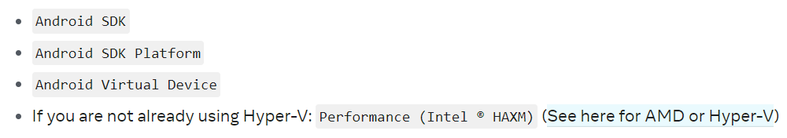

Android Studio 설치 과정에서 위 목록에 존재하는 도구들을 체크하여 함께 설치합니다.

### Step 2 : Android SDK 12(S) 설치

Android Studio는 기본적으로 최신의 Android SDK를 설치합니다. 그러나 React Native는 Android 12(S) 버전의 SDK를 필요로 하므로 Android Studio의 SDK Manager를 열어 Android 12.0(S)를 체크합니다. 추가로 하단의 Show Package Details를 눌러 아래 2가지 항목도 추가로 체크한 후 설치를 진행합니다.

- `Android SDK Platform 31`
- `Intel x86 Atom_64 System Image` or `Google APIs Intel x86 Atom System Image`

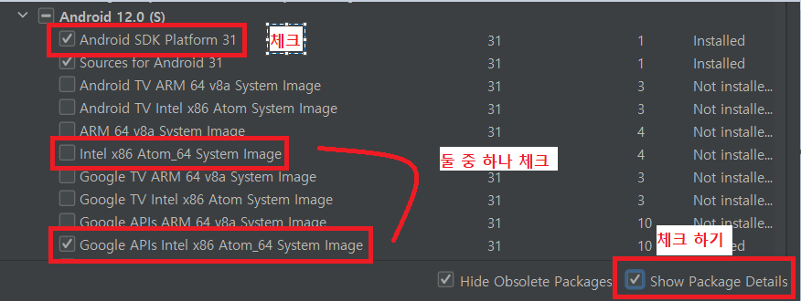

## ANDROID_HOME 환경 변수 설정

Android SDK 사용을 위해 ANDROID_HOME 환경 변수가 필요합니다. 아래 처럼 Android SDK의 경로를 추가해줍니다.

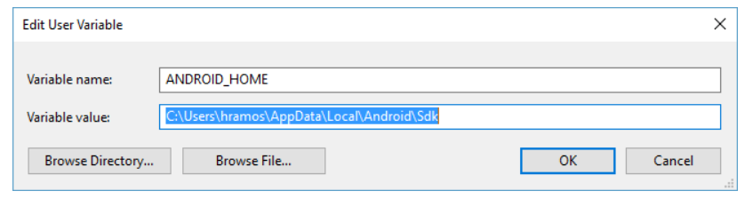

## platform-tools 경로 환경 변수에 설정

`ANDROID_HOME` 환경 변수가 잘 설정되었다면 `%LOCALAPPDATA%\Android\Sdk`를 통해서 SDK 경로를 참조할 수 있습니다. `ANDROID_HOME`을 성공적으로 설정했다면 `Path`라는 환경 변수에 아래 경로를 추가해줍니다.

```
🔗 %LOCALAPPDATA%\Android\Sdk\platform-tools
```

안드로이드 앱 개발시 필요한 디버거등 다양한 도구가 위치하고 있습니다.

## React Native Command Line Interface(CLI)

이제 안드로이드 앱 개발을 위한 개발 환경이 모두 준비되었습니다. 본격적으로 React Native 프로젝트를 생성하기 위해 `react-native-cli` 패키지가 필요합니다. 위에서 `Node.js`를 설치했으므로 `npm`도 함께 설치되었을 것 입니다.

React Native는 `npx`를 통해 최신의 `react-native-cli`를 사용할 것을 추천하고 있습니다. 만약 이미 `react-native-cli`를 global로 설치했다면 예상치 못한 에러를 방지하기 위해 제거 해줍니다.

```shell
🔗 npm uninstall -g react-native-cli @react-native-community/cli
```

이제 안전하게 최신 `react-native-cli`패키지를 통해 React Native 프로젝트를 생성할 수 있습니다.

```shell
🔗 npx react-native init AwesomeProject
```

## 실제 안드로이드 폰으로 실행하기

안드로이드 폰이 있다면 USB 케이블로 연결하여 React Native앱을 직접 실행해볼 수 있습니다.

<aside>
  
🔗 [https://reactnative.dev/docs/running-on-device](https://reactnative.dev/docs/running-on-device)

</aside>

## Virtual Device로 실행하기

생성된 프로젝트의 하위 폴더를 보면 `android`라는 폴더를 찾을 수 있습니다. 해당 경로를 Android Studio로 열면 `AVD Manager`를 통해 사용 가능한 안드로이드 Virtual Device의 목록을 확인할 수 있습니다. `Create device` 버튼을 누른 후 Phone 탭에서 아무 기기나 선택합니다. 다음 페이지에서 API Level이 31일 System Image를 선택하면 우리의 React Native를 안정적으로 실행시킬 수 있는 Virtual Device를 생성할 수 있습니다.

### - API Level이 31임을 꼭 확인해주세요

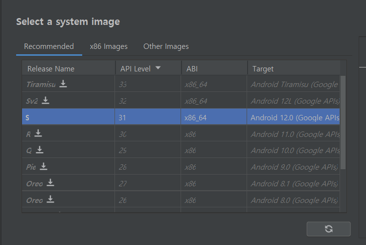

## React Native 앱 실행하기

React Native를 실행하기 위해 `Metro`라는 자바스크립트 번들러를 사용합니다. `Metro`는 웹 개발에서의 `Webpack`과 비슷한 역할을 수행합니다. `react-native-cli`가 이미 `Metro`를 포함하고 있으므로 따로 설치할 필요는 없습니다. 아래 명령어를 프로젝트 루트에서 실행합니다.

```shell
🔗 npx react-native start

# or

npm start
```

아래와 같은 모양이 그려지면 `Metro`가 정상적으로 실행되는 상태입니다. `Metro`가 React Native를 index.js로 번들링하고 있음을 알 수 있습니다.

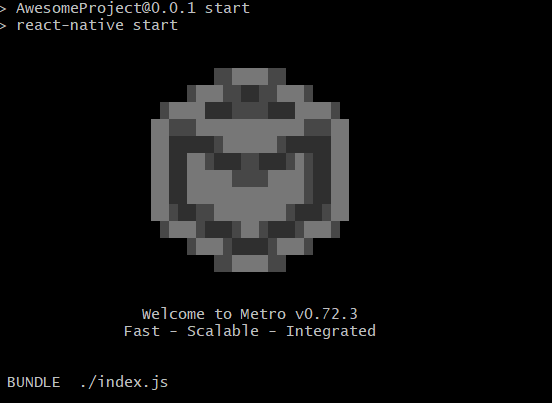

번들링이 된 React Native 앱을 안드로이드 폰이나 Virtual Device에서 실행할 수 있습니다. 아래 명령어를 프로젝트 루트에서 실행합니다.

```shell
🔗 npx react-native run-android

# or

npm run android
```

만약 모든 설치와 설정이 잘 되었다면, 연결된 기기를 통해 React Native앱이 실행될 것 입니다.

### - 잘 실행되는 React Native 앱

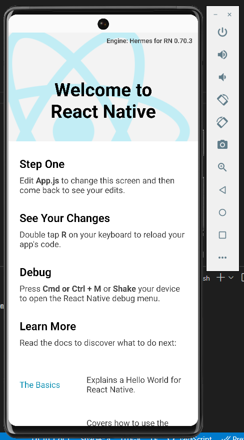

</details>

<details>
<summary> 프로젝트 실행 </summary>
  
  ### Installing Dependencies
  1. 프로젝트 root 디렉토리에서 `yarn` 명령어를 사용하여 필요한 라이브러리 설치

### Metro 실행

1. Metro는 작성된 React 코드를 번들링하여 네이티브 앱에 올려주는 역할을 하는 번들러입니다.
2. `npm start` 명령어를 통해 Metro를 실행할 수 있습니다. 컴퓨터와 연결된 안드로이드 기기가 있다면 자동으로 연결되며, 없다면 안드로이드 가상 머신이 필요합니다.

### react-native 개발 버전 실행

1. `npm run android` 명령어를 통해 연결된 안드로이드 기기에 Meeplo앱을 개발 모드로 실행합니다.

</details>

<details>
<summary> 프로젝트 빌드 </summary>

### APK 추출

- 프로젝트의 `android` 폴더로 이동하여 아래 명령어를 입력합니다.

```shell
# 배포 버전 APK
./gradlew app:assembleRelease

# 개발 버전 APK
./gradlew app:assembleDebug
```

### AAB 추출

- 마찬가지로 `android` 폴더로 이동하여 아래 명렁어를 입력합니다.

```shell
# 배포 버전 APK
 ./gradlew assembleRelease

# 개발 버전 APK
./gradlew assembleDebug
```

</details>

### 2. Meeplo Map Web

- 버전
  - react `18.2.0`
  - react-kakao-maps-sdk `^1.1.5`
    - kakao map을 react에서 편하게 사용할 수 있는 sdk 라이브러리
  - webpack `^5.74.0` webpack-cli `^4.10.0` webpack-dev-server `^4.11.1`
  - @babel/core `^7.20.0`
- 설정 파일

  - src/index.html에서 발급받은 카카오 지도 서비스 appkey를 등록합니다.

  ```html
  <script
    type="text/javascript"
    src="//dapi.kakao.com/v2/maps/sdk.js?appkey={발급 받은 appkey 등록}&libraries=services,clusterer"
  ></script>
  ```

- 프로젝트 실행
  1. `yarn` 명령어를 사용하여 필요한 dependencies를 받습니다.
  2. `npm start` 명령어를 통해 webpack-dev-server를 실행할 수 있습니다.
- 프로젝트 빌드
  1. `yarn` 명령어를 사용하여 필요한 dependencies를 받습니다.
  2. `npm run build` 명령어를 통해 리액트 프로젝트를 번들링할 수 있습니다.
  3. /dist 폴더에서 빌드된 결과물을 확인할 수 있습니다.

## Server

### 1. Backend

- 버전
  - IDE : IntelliJ
  - 언어 : Java `OpenJDK 11`
  - DataBase
    - MySQL `8.0.31`
    - Redis `7.0.5`
  - Libraries & Frameworks
    - Spring Boot `2.7.4`
    - Gradle `gradle-7.4-bin`
    - JPA `2.7.4`
    - Spring Security `2.7.4`
    - Swagger `3.0.0`
    - Selenium `4.5.3`
    - Jsoup `1.15.3`
- 설정파일

  <details>
  <summary>build.gradle</summary>

  ```java
  plugins {
  	id 'org.springframework.boot' version '2.7.4'
  	id 'io.spring.dependency-management' version '1.0.14.RELEASE'
  	id 'java'
  }

  group = 'com.sloth'
  version = '0.0.1-SNAPSHOT'
  sourceCompatibility = '11'

  configurations {
  	compileOnly {
  		extendsFrom annotationProcessor
  	}
  }

  repositories {
  	mavenCentral()
  }

  jar {
  	enabled = false
  }

  dependencies {
  	// jwt
  	implementation 'io.jsonwebtoken:jjwt:0.9.1'

  	// springboot
  	implementation 'org.springframework.boot:spring-boot-starter-web'
  	implementation 'org.springframework.boot:spring-boot-starter-data-jpa'

  	//Swagger
  	implementation group: 'io.springfox', name: 'springfox-boot-starter', version: '3.0.0'
  	implementation group: 'io.springfox', name: 'springfox-swagger-ui', version: '3.0.0'

  	// spring security
  	implementation 'org.springframework.boot:spring-boot-starter-security'

  	// json
  	implementation 'com.google.code.gson:gson'
      implementation 'org.springframework.boot:spring-boot-starter-validation:2.7.5'
      implementation 'org.json:json:20220924'

      // lombok
  	compileOnly 'org.projectlombok:lombok'
  	annotationProcessor 'org.projectlombok:lombok'

  	// JDBC
  	runtimeOnly 'mysql:mysql-connector-java'

  	// Log(AOP)
  	implementation 'org.springframework.boot:spring-boot-starter-aop'

  	// test
  	testImplementation 'org.springframework.boot:spring-boot-starter-test'
  	testImplementation 'org.springframework.security:spring-security-test'

  	// Redis
  	implementation 'org.springframework.boot:spring-boot-starter-data-redis'
  }

  tasks.named('test') {
  	useJUnitPlatform()
  }
  ```

  </details>

  <details>
  <summary>application.yml</summary>

  ```yaml
  #JPA
  spring:
    redis:
      host: { REDIS_HOST }
      port: { REDIS_PORT }
      password: { REDIS_PASSWORD }

    datasource:
      url: jdbc:mysql://{MYSQL_HOST}:{MYSQL_PORT}/{MYSQL_SCHEMA}?allowPublicKeyRetrieval=true&useSSL=false&characterEncoding=UTF-8&serverTimezone=Asia/Seoul
      username: { MYSQL_USERNAME }
      password: { MYSQL_PASSWORD }
      driver-class-name: com.mysql.cj.jdbc.Driver
    mvc:
      pathmatch:
        matching-strategy: ant_path_matcher
    jpa:
      database: mysql
      database-platform: org.hibernate.dialect.MySQL8Dialect
      #    show_sql: true
      hibernate:
        ddl-auto: update
        naming:
          strategy: org.hibernate.cfg.ImprovedNamingStrategy

      properties:
        hibernate:
          globally_quoted_identifiers: true
          format_sql: true
          enable_lazy_load_no_trans: true

  jwt:
    secret: { JWT_KEY }

  kakao:
    restapikey: { KAKAO_RESTAPI_KEY }

  OpenRouterService:
    api_key: { OPENROUTESERVICE_API_KEY }

  FastApiAccess:
    address: { FASTAPI_ADDRESS }
  ```

  </details>

- 실행 순서
  1. git 에서 backend 브랜치를 clone 받는다
  2. 해당 프로젝트를 Intellij로 열고 실행해 준다.

### 2. Recommendation

- 버전
  - IDE : Visual Studio
  - 언어 : Python `3.10.8`
  - Libraries & Frameworks
    - Fast API `0.87.0`
    - Uvicorn `0.19.0`
    - Gensim `4.2.0`
      - Word2Vec, FastText 사용을 위한 library
    - Shapely `1.8.5`
      - 무게 중심을 찾기 위한 library
- 설정 파일
<details>
<summary>.env</summary>

### path : /app

```
USER={MYSQL_USERNAME}
PASSWORD={MYSQL_PASSWORD}
HOST={MYSQL_HOST}
PORT={MYSQL_PORT}
SCHEMA={MYSQL_SCHEMA}
```

</details>

<details>
<summary>requirements.txt</summary>

### path : /

```
anyio==3.6.2
click==8.1.3
colorama==0.4.6
contourpy==1.0.6
cycler==0.11.0
Cython==0.29.28
fastapi==0.87.0
fonttools==4.38.0
gensim==4.2.0
greenlet==2.0.1
h11==0.14.0
idna==3.4
joblib==1.2.0
JPype1==1.4.1
kiwisolver==1.4.4
konlpy==0.6.0
lxml==4.9.1
matplotlib==3.6.2
nltk==3.7
numpy==1.23.4
packaging==21.3
pandas==1.5.1
Pillow==9.3.0
psutil==5.9.4
pydantic==1.10.2
PyMySQL==1.0.2
pyparsing==3.0.9
python-dateutil==2.8.2
python-dotenv==0.21.0
pytz==2022.6
regex==2022.10.31
scikit-learn==1.1.3
scipy==1.9.3
Shapely==1.8.5.post1
six==1.16.0
smart-open==6.2.0
sniffio==1.3.0
soynlp==0.0.493
SQLAlchemy==1.4.44
starlette==0.21.0
threadpoolctl==3.1.0
tqdm==4.64.1
typing_extensions==4.4.0
uvicorn==0.19.0
```

</details>

- 실행 순서

  ```bash
  # python 설치

  # 로컬에서 실행을 위한 가상 환경 세팅
  python -m venv venv

  # visual studio에서 python interpreter 설정

  # 가상 환경 활성화
  source ./venv/Script/activate

  # fast api 구동
  uvicorn main:app --reload
  ```

## CI/CD

- 버전
  - Kubernetes : `1.25.3`

<details>
<summary>1. K8S Cluster 구축</summary>

## Initializing

Master node 로 사용할 EC2 머신에서 다음을 실행한다.

프로젝트에서는 내부 ip 주소 `172.26.4.6` 을 사용

```bash
kubeadm init --apiserver-advertise-address 172.26.4.6 --pod-network-cidr=172.26.0.1/24
```

다음과 같은 결과물을 확인할 수 있다.

```bash
kubeadm join 172.26.4.6:6443 --token jg65kw.wjysf4vsdq8cng9h \
        --discovery-token-ca-cert-hash sha256:598e690d207cac04847cf94210be210b413e70f2e2307f1933b6a21030ed3a6c
```

Worker node 에서 해당 명령어를 실행하면 생성된 클러스터에 노드로 추가할 수 있다.

시간이 지나서 토큰이 만료되거나 한 경우나 해당 내용을 잊어버린 경우 master node에서 다음 명령어로 다시 같은 명령어 출력이 가능하다.

```bash
kubeadm token create --print-join-command
```

## Master node join trouble shooting

### cri 관련 오류

- Worker node 에서 다음을 실행한다.

  ```bash
  sed -i 's/cri//' /etc/containerd/config.toml
  sed -n '/cri/p' /etc/containerd/config.toml
  systemctl restart containerd
  ```

### 시간 초과가 나는 경우

- Worker node를 초기화한다.

  ```bash
  kubeadm reset
  rm -r /etc/cni/net.d
  rm -r /home/ubuntu/.kube/config
  ```

### 추가는 되는데 시간이 지나도 node의 상태가 `Not Ready` 가 지속되는 경우

1. 해당하는 node의 `kube-proxy` pod를 삭제한다. `calico` pod는 자동으로 삭제되지만 안되는 경우 직접 삭제한다.

   ```bash
   # 어떤 kube-proxy가 어떤 node에서 실행중인지 확인
   kubectl get pods --all-namespaces -o wide | grep kube-proxy
   # 해당 pod 지우기
   kubectl delete pods *PROXY_NAME* -n kube-system
   ```

2. 해당 node를 삭제한다.

   ```bash
   kubectl delete node *NODE_NAME*
   ```

3. 해당 node를 재부팅한다.
4. Master node의 `containerd` 재시작

   ```bash
   systemctl restart containerd
   ```

### Master node 자체가 문제가 생긴 경우

- Master node를 초기화한다.

  ```bash
  kubeadm reset
  rm -r /etc/cni/net.d
  rm -r /home/ubuntu/.kube/config
  ```

</details>

<details>
<summary>2. Jenkins 설치</summary>

### 1. namespace 생성

```bash
kubectl create namespace jenkins
```

### 2. Service account 생성

```bash
kubectl apply -f serviceAccount.yaml
```

<details>
<summary> serviceAccount.yaml </summary>

```yaml
---
apiVersion: rbac.authorization.k8s.io/v1
kind: ClusterRole
metadata:
  name: jenkins-admin
rules:
  - apiGroups: ["*"]
    resources: ["*"]
    verbs: ["*"]
---
apiVersion: v1
kind: ServiceAccount
metadata:
  name: jenkins-admin
  namespace: jenkins
---
apiVersion: rbac.authorization.k8s.io/v1
kind: ClusterRoleBinding
metadata:
  name: jenkins-admin
roleRef:
  apiGroup: rbac.authorization.k8s.io
  kind: ClusterRole
  name: jenkins-admin
subjects:
  - kind: ServiceAccount
    name: jenkins-admin
    namespace: jenkins
```

- `rules.apiGroups`를 `["*"]`로 주어야 jenkins 내부에서 `kubectl` 명령을 내릴 수 있다. 권한이 jenkins 홈페이지에서 제시하는 `[""]`로 되어있는 경우 다음과 같은 에러가 발생한다.

      ```bash
      Error from server (Forbidden): deployments.apps "backend-server" is forbidden: User "system:serviceaccount:jenkins:jenkins-admin" cannot get resource "deployments" in API group "apps" in the namespace "default"
      ```

  </details>

### 3. PV / PVC 생성

```bash
kubectl create -f volume.yaml
```

<details>
<summary>volume.yaml</summary>

```yaml
kind: StorageClass
apiVersion: storage.k8s.io/v1
metadata:
  name: local-storage
provisioner: kubernetes.io/no-provisioner
volumeBindingMode: WaitForFirstConsumer
---
apiVersion: v1
kind: PersistentVolume
metadata:
  name: jenkins-pv-volume
  labels:
    type: local
spec:
  storageClassName: local-storage
  claimRef:
    name: jenkins-pv-claim
    namespace: jenkins
  capacity:
    storage: 10Gi
  accessModes:
    - ReadWriteOnce
  local:
    path: /mnt
  nodeAffinity:
    required:
      nodeSelectorTerms:
        - matchExpressions:
            - key: kubernetes.io/hostname
              operator: In
              values:
                - ip-172-26-0-39
---
apiVersion: v1
kind: PersistentVolumeClaim
metadata:
  name: jenkins-pv-claim
  namespace: jenkins
spec:
  storageClassName: local-storage
  accessModes:
    - ReadWriteOnce
  resources:
    requests:
      storage: 3Gi
```

- `spec.nodeAffinity`에 설정한 `values`에는 jenkins를 실행할 노드의 이름을 넣는다. 해당 프로젝트는 2번 Worker node로 설정.
</details>

### 4. Deployment 생성

Jenkins에서 `docker`와 `kubectl`을 쓰기 위해서는 설치를 한 상태여야 한다. Jenkins 공식 이미지에는 설치되어 있지 않으므로 pod가 종료될 것을 대비하여 위 둘을 설치한 새로운 Jenkins 이미지를 만들어 사용한다.

```bash
# 공식 image pull
docker pull jenkins/jenkins:lts

# 권한 설정
chmod 777 /var/jenkins

# 해당 이미지로 컨테이너 실행
docker run -d -p 9090:8080 -p 50000:50000 -v /var/jenkins:/var/jenkins_home --name jenkins jenkins/jenkins:lts

# root 권한으로 jenkins 내부 접근
docker exec -it -u 0 jenkins bash

# kubectl 설치, k8s 클러스터에서 사용하는 1.25.3 버젼으로 통일
curl -LO "https://dl.k8s.io/release/v1.25.3/bin/linux/amd64/kubectl"
curl -LO "https://dl.k8s.io/v1.25.3/bin/linux/amd64/kubectl.sha256"
echo "$(cat kubectl.sha256)  kubectl" | sha256sum --check
install -o root -g root -m 0755 kubectl /usr/local/bin/kubectl

# 설치된 kubectl 버젼 확인
kubectl version --client --short

# docker 설치
apt-get remove docker docker-engine docker.io containerd runc
apt-get update
apt-get install \
    ca-certificates \
    curl \
    gnupg \
    lsb-release
mkdir -p /etc/apt/keyrings
curl -fsSL https://download.docker.com/linux/debian/gpg | gpg --dearmor -o /etc/apt/keyrings/docker.gpg
echo \
  "deb [arch=$(dpkg --print-architecture) signed-by=/etc/apt/keyrings/docker.gpg] https://download.docker.com/linux/debian \
  $(lsb_release -cs) stable" | tee /etc/apt/sources.list.d/docker.list > /dev/null
apt-get update
apt-get install docker-ce docker-ce-cli containerd.io docker-compose-plugin

# jenkins 컨테이너 나오기
exit

# jenkins 컨테이너 정지
docker stop jenkins

# kubectl 및 docker 가 설치된 jenkins 컨테이너 이미지화
docker commit jenkins meeplo/jenkins:latest

# dockerhub 접근을 위한 login
docker login      # 여기서 dockerhub 계정으로 로그인한다.

# docker hub에 생성된 image 올리기
docker push meeplo/jenkins
```

- 올린 이미지를 사용하여 deployment를 구성해준다.

  ```bash
  kubectl apply -f deployment.yaml
  ```

<details>
<summary>deployment.yaml</summary>

```yaml
apiVersion: apps/v1
kind: Deployment
metadata:
  name: jenkins
  namespace: jenkins
spec:
  replicas: 1
  selector:
    matchLabels:
      app: jenkins-server
  template:
    metadata:
      labels:
        app: jenkins-server
    spec:
      securityContext:
            fsGroup: 1000
            runAsUser: 1000
      serviceAccountName: jenkins-admin
      containers:
        - name: jenkins
          image: meeplo/jenkins:latest
          resources:
            limits:
              memory: "2Gi"
              cpu: "1000m"
            requests:
              memory: "500Mi"
              cpu: "500m"
          ports:
            - name: httpport
              containerPort: 8080
            - name: jnlpport
              containerPort: 50000
          livenessProbe:
            httpGet:
              path: "/login"
              port: 8080
            initialDelaySeconds: 90
            periodSeconds: 10
            timeoutSeconds: 5
            failureThreshold: 5
          readinessProbe:
            httpGet:
              path: "/login"
              port: 8080
            initialDelaySeconds: 60
            periodSeconds: 10
            timeoutSeconds: 5
            failureThreshold: 3
          volumeMounts:
            - name: jenkins-data
              mountPath: /var/jenkins_home
    				- name: docker-socket
    					mountPath: /var/run/docker.sock
    			securityContext:
    				allowPrivilegeEscalation: false
    				runAsUser: 0
      volumes:
        - name: jenkins-data
          persistentVolumeClaim:
            claimName: jenkins-pv-claim
  			- name: docker-socket
    		  hostPath:
    		    path: /var/run/docker.sock
```

- `securityContext` 는 root 권한 필요한 경우에 추가한다.
</details>

### 5. Service 생성

```bash
kubectl apply -f service.yaml
```

<details>
<summary>service.yaml</summary>

```yaml
apiVersion: v1
kind: Service
metadata:
  name: jenkins-service
  namespace: jenkins
  annotations:
    prometheus.io/scrape: "true"
    prometheus.io/path: /
    prometheus.io/port: "8080"
spec:
  selector:
    app: jenkins-server
  type: NodePort
  ports:
    - port: 8080
      targetPort: 8080
      nodePort: 32000
```

</details>

### 6. 접근

- [Jenkins 접근 링크](http://k7a508.p.ssafy.io:32000/login?from=%2F)

</details>

<details>
<summary>3. MySQL 설치</summary>

### 1. Storage class 생성

```bash
kubectl apply -f ./local-storage.yaml
```

<details>
<summary>local-storage.yaml</summary>

```yaml
kind: StorageClass
apiVersion: storage.k8s.io/v1
metadata:
  name: local-storage
provisioner: kubernetes.io/no-provisioner
volumeBindingMode: WaitForFirstConsumer
```

</details>

### 2. Persistent Volume(PV) 생성

1. DB를 저장할 node에서 mysql 폴더를 생성한다.

   ```bash
   mkdir -p /workspace/data/kubernetes/pv/mysql
   chmod 777 /workspace/data/kubernetes/pv/mysql/
   ```

2. Master node에서 kubectl 로 적용한다.

   ```bash
   kubectl apply -f ./pv.yaml
   ```

   <details>
   <summary>pv.yaml</summary>

   ```yaml
   apiVersion: v1
   kind: PersistentVolume
   metadata:
     name: pv-mysql
   spec:
     capacity:
       storage: 10Gi
     accessModes:
       - ReadWriteOnce
     persistentVolumeReclaimPolicy: Retain
     storageClassName: local-storage
     local:
       path: /workspace/data/kubernetes/pv/mysql
     nodeAffinity:
       required:
         nodeSelectorTerms:
           - matchExpressions:
               - key: kubernetes.io/hostname
                 operator: In
                 values:
                   - ip-172-26-1-74
   ```

   - 마지막 values는 어느 node에 pv가 위치할지 결정한다. 여기서는 worker node 3를 사용.
   </details>

### 3. Persistent Volume Claim(PVC) 생성

```bash
kubectl apply -f ./pvc.yaml
```

<details>
<summary>pvc.yaml</summary>

```yaml
kind: PersistentVolumeClaim
apiVersion: v1
metadata:
  name: pvc-mysql
spec:
  accessModes:
    - ReadWriteOnce
  storageClassName: local-storage
  resources:
    requests:
      storage: 10Gi
```

</details>

### 4. Configmap 생성

```bash
# Please put your mysql username instead of {MYSQL_USERNAME}
kubectl create configmap configmap-mysql --from-literal MYSQL_USER={MYSQL_USERNAME} --from-literal MYSQL_ROOT_HOST=%
```

### 5. Secret 생성

```bash
# Please put your mysql password instead of {MYSQL_PASSWORD}
kubectl create secret generic secret-mysql --from-literal MYSQL_PASSWORD={MYSQL_PASSWORD} --from-literal MYSQL_ROOT_PASSWORD={MYSQL_PASSWORD}
```

### 6. Deployment 생성

```bash
kubectl apply -f ./deployment.yaml
```

<details>
<summary>deployment.yaml</summary>

```yaml
apiVersion: apps/v1
kind: Deployment
metadata:
  name: mysql
spec:
  selector:
    matchLabels:
      app: mysql
  strategy:
    type: Recreate
  template:
    metadata:
      labels:
        app: mysql
    spec:
      containers:
      - image: mysql/mysql-server:latest
        name: mysql
        env:
        - name: MYSQL_USER
          valueFrom:
            configMapKeyRef
              name: configmap-mysql
              key: MYSQL_USER
        - name: MYSQL_PASSWORD
          valueFrom:
            secretKeyRef:
              name: secret-mysql
              key: MYSQL_PASSWORD
        - name: MYSQL_ROOT_PASSWORD
          valueFrom:
            secretKeyRef:
              name: secret-mysql
              key: MYSQL_ROOT_PASSWORD
        - name: MYSQL_ROOT_HOST
          valueFrom:
            configMapKeyRef:
              name: configmap-mysql
              key: MYSQL_ROOT_HOST
        ports:
        - containerPort: 3306
          name: mysql
        volumeMounts:
        - name: volume-mysql
          mountPath: /var/lib/mysql
      volumes:
      - name: volume-mysql
        persistentVolumeClaim:
          claimName: pvc-mysql
```

</details>

### 7. Service 생성

```bash
kubectl apply -f ./service.yaml
```

<details>
<summary>service.yaml</summary>

```yaml
apiVersion: v1
kind: Service
metadata:
  name: service-mysql
spec:
  type: LoadBalancer
  selector:
    app: mysql
  externalIPs:
    - 192.168.0.6
  ports:
    - protocol: TCP
      port: 3306
      targetPort: 3306
      nodePort: 30000
```

</details>

### 8. 접근

- k8s 내부 : 192.168.0.6:3306
- k8s 외부 : k7a508.p.ssafy.io:30000
</details>

<details>
<summary>4. Redis 설치</summary>

### 1. namespace 생성

```bash
kubectl create namespace redis
```

### 2. Deployment 생성

```bash
kubectl apply -f deployment.yaml
```

<details>
<summary>deployment.yaml</summary>

```yaml
apiVersion: apps/v1
kind: Deployment
metadata:
  namespace: redis
  name: redis
  labels:
    app: redis
spec:
  replicas: 1
  selector:
    matchLabels:
      app: redis
  template:
    metadata:
      labels:
        app: redis
    spec:
      containers:
        - name: redis
          image: "redis:latest"
          ports:
            - containerPort: 6379
          command:
            - redis-server
          args:
            - --requirepass
            - { REDIS_PASSWORD } # put your password here
```

- 비밀번호를 설정하지 않는 경우 보안에 문제성이 생기므로 반드시 설정해준다. 공식에서 배포하는 이미지의 경우 비밀번호가 걸려있지 않다.

</details>

### 3. Service 생성

```bash
kubectl apply -f service.yaml
```

<details>
<summary>service.yaml</summary>

```yaml
apiVersion: v1
kind: Service
metadata:
  namespace: redis
  name: service-redis
  labels:
    app: redis
spec:
  type: LoadBalancer
  externalIPs:
    - 192.168.0.79
  ports:
    - port: 6379
      targetPort: 6379
  selector:
    app: redis
```

</details>

### 4. 접근

- k8s 내부 : 192.168.0.79:6379
- k8s 외부 : k7a508.p.ssafy.io:31666
- cluster 내부에서 접근

  ```bash
  kubectl exec -it $(kubectl get pods -n redis -o NAME) -n redis -- redis-cli
  ```

</details>

<details>   
<summary>5. Backend 구동</summary>

### 1. 파일 준비

1. Jenkins 가 설치된 worker node 2번에 `/mnt` 내부에 빌드를 위한 파일들을 관리할 `build`를 생성해준다.

2. `/backend`를 생성하고 내부에 `Dockerfile`, `application-server.yaml`을 작성한다.

   <details>
   <summary>Dockerfile</summary>

   ```docker
   FROM openjdk:11-jre-slim-buster
   ARG JAR_FILE=build/libs/*.jar
   COPY ${JAR_FILE} app.jar
   EXPOSE 8080
   ENTRYPOINT ["java", "-jar", "/app.jar"]
   ```

   - 경량화를 위해 `openjdk:11-jre-slim-buster` 를 사용. [참조](https://stackoverflow.com/questions/53375613/why-is-the-java-11-base-docker-image-so-large-openjdk11-jre-slim)

   </details>

   <details>
   <summary>application-server.yaml</summary>

   ```yaml
   #JPA
   spring:
     datasource:
       url: jdbc:mysql://192.168.0.6:3306/meeplo?allowPublicKeyRetrieval=true&useSSL=false&characterEncoding=UTF-8&serverTimezone=Asia/Seoul
       username: { MYSQL_USERNAME }
       password: { MYSQL_PASSWORD }
       driver-class-name: com.mysql.cj.jdbc.Driver
     mvc:
       pathmatch:
         matching-strategy: ant_path_matcher
     jpa:
       database: mysql
       database-platform: org.hibernate.dialect.MySQL8Dialect
       show_sql: false
       hibernate:
         ddl-auto: update
         naming:
           strategy: org.hibernate.cfg.ImprovedNamingStrategy
       properties:
         hibernate:
           globally_quoted_identifiers: true
           format_sql: true
           enable_lazy_load_no_trans: true
     redis:
       host: 192.168.0.79
       port: 6379
       password: { REDIS_PASSWORD }

   jwt:
     secret: { JWT_SECRET_KEY }

   kakao:
     restapikey: { KAKAO_REST_API_KEY }

   OpenRouterService:
     api_key: { OPEN_ROUTER_SERVICE_API_KEY }

   FastApiAccess:
     address: http://192.168.0.8:8000/meeplo/recommendation/v1
   ```

   </details>

### 2. Deployment 생성

```bash
kubectl apply -f deployment.yaml
```

<details>
<summary>deployment.yaml</summary>

```yaml
apiVersion: apps/v1
kind: Deployment
metadata:
  name: backend-server
  labels:
    app: backend-server
spec:
  selector:
    matchLabels:
      app: backend-server
  template:
    metadata:
      labels:
        app: backend-server
    spec:
      affinity:
        podAntiAffinity:
          preferredDuringSchedulingIgnoredDuringExecution:
            - podAffinityTerm:
                labelSelector:
                  matchExpressions:
                    - key: app
                      operator: In
                      values:
                        - backend-server
                topologyKey: kubernetes.io/hostname
              weight: 100
      containers:
        - name: backend-server
          image: meeplo/backend:latest
          imagePullPolicy: Always
          ports:
            - containerPort: 8080
```

- `podAntiAffinity`를 설정해야 노드에 고르게 생성된다. 직접 올린 이미지 `meeplo/backend:latest`를 다운받아서 deployment를 구성한다. 초기 구동시에는 Dockerhub에 이미지를 올려두거나, 임의의 다른 이미지를 사용한다.

</details>

### 3. HPA 생성

**Horizontal Pod Autoscaling, 즉 자동으로 pod의 갯수를 관리해주는 설정**

```bash
kubectl apply -f hpa.yaml
```

<details>
<summary>hpa.yaml</summary>

```yaml
apiVersion: autoscaling/v2beta2
kind: HorizontalPodAutoscaler
metadata:
  name: backend-server-hpa
spec:
  scaleTargetRef:
    apiVersion: apps/v1
    kind: Deployment
    name: backend-server
  minReplicas: 3
  maxReplicas: 20
  metrics:
    - type: Resource
      resource:
        name: cpu
        target:
          type: Utilization
          averageUtilization: 60
  behavior:
    scaleDown:
      stabilizationWindowSeconds: 300
      policies:
        - type: Percent
          value: 50
          periodSeconds: 30
    scaleUp:
      stabilizationWindowSeconds: 0
      policies:
        - type: Percent
          value: 100
          periodSeconds: 15
        - type: Pods
          value: 4
          periodSeconds: 15
      selectPolicy: Max
---
apiVersion: policy/v1
kind: PodDisruptionBudget
metadata:
  name: backend-server-pdb
spec:
  minAvailable: 1
  selector:
    matchLabels:
      app: backend-server
---
```

</details>

### 4. Service 생성

```bash
kubectl apply -f service.yaml
```

<details>
<summary>service.yaml</summary>

```yaml
apiVersion: v1
kind: Service
metadata:
  name: service-backend
spec:
  type: LoadBalancer
  selector:
    app: backend-server
  externalIPs:
    - 192.168.0.80
  ports:
    - protocol: TCP
      port: 8080
      targetPort: 8080
      nodePort: 30080
```

</details>

### 5. HPA 및 deployment 정상 작동 확인법

```bash
kubectl rollout restart deployment backend-server && watch kubectl get pods
```

### 6. 접근 방법

- k8s 내부 : 192.168.0.80:8080
- k8s 외부 : k7a508.p.ssafy.io:30080

### 7. Jenkins 설정

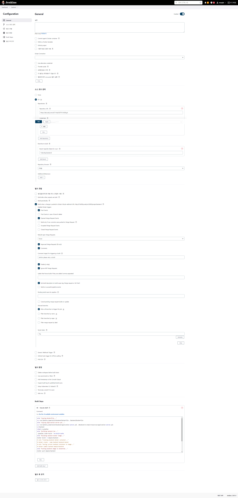

<details>
<summary>Execute shell의 내용</summary>

```bash
echo "Copying Dockerfile..."
cp /var/jenkins_home/build/backend/Dockerfile ./Backend/Dockerfile

echo "Copying application-server.yml..."
cp /var/jenkins_home/build/backend/application-server.yml ./Backend/src/main/resources/application-server.yml

cd Backend
chmod +x gradlew

echo "Building backend jar..."
./gradlew clean build --no-build-cache

echo "Building backend docker image..."
docker build -t meeplo/backend .

echo "Pushing backend image to dockerhub..."
docker push meeplo/backend

echo "Deleting backend image..."
docker images -f reference="meeplo/backend:latest" -q && docker rmi $(docker images -f referencecho "Restarting deployment..."
kubectl rollout restart deployment backend-server -n default
```

</details>

### 8. Ingress 적용

**k8s 클러스터 외부에서 내부에 접근하기 위해서는 서비스를 외부에 노출해주는 Ingress가 필요하다.**

**Service에서도 노출은 가능하나, :30080 등의 포트로 들어가야 하기에 요청 편의성을 위해 ingress를 사용한다.**

1.  nginx ingress controller를 설치한다.

    ```bash
    kubectl apply -f https://raw.githubusercontent.com/kubernetes/ingress-nginx/controller-v1.0.0/deploy/static/provider/baremetal/deploy.yaml
    ```

    `kubectl get svc -n ingress-nginx` 명령어로 확인하면 외부 ip 주소를 받지 못하는 것을 확인할 수 있다.

    `kubectl logs ingress-nginx-controller-*controllername* -n ingress-nginx` 로 확인하면 다음과 같이 `IngressClass`가 없어서 그렇다는 메시지를 확인할 수 있다.

    ```bash
    I1117 05:11:54.592808       7 store.go:361] "Ignoring ingress because of error while validating ingress class" ingress="default/meeplo-ingress" error="ingress does not contain a valid IngressClass
    ```

2.  `IngressClass`를 생성해준다.

    ```bash
    kubectl apply -f ingressClass.yaml
    ```

    <details>
    <summary>ingressClass.yaml</summary>

    ```yaml
    apiVersion: networking.k8s.io/v1
    kind: IngressClass
    metadata:
      labels:
        app.kubernetes.io/component: controller
      name: default-ingress-class
      annotations:
        ingressclass.kubernetes.io/is-default-class: "true"
    spec:
      controller: k8s.io/ingress-nginx
    ```

    </details>

3.  `Ingress`를 생성한다.

    ```bash
    kubectl apply -f ingress.yaml
    ```

    <details>
    <summary>ingress.yaml</summary>

    ```yaml
    apiVersion: networking.k8s.io/v1
    kind: Ingress
    metadata:
      name: meeplo-ingress
      annotations:
        nginx.ingress.kubernetes.io/rewrite-target: /$1
    spec:
      ingressClassName: default-ingress-class
      rules:
        - host: "k7a508.p.ssafy.io"
          http:
            paths:
              - pathType: ImplementationSpecific
                path: /(.*)
                backend:
                  service:
                    name: service-backend
                    port:
                      number: 80
    ```

    - `path`의 경우 위와 같은 정규식으로 작성해주어야 하위 url 역시 접근 가능하다.

    - `nginx.ingress.kubernetes.io/rewrite-target`의 경우도 nginx의 경우 `$1`로 설정해야 작동한다. [참조](https://gruuuuu.github.io/cloud/ingress-annotations/)

    - `kubectl get svc -n ingress-nginx`으로 확인했을 때 다음과 같이 나오면 접속 가능하다.

      ```bash
      ingress-nginx-controller             NodePort    10.111.142.6     <none>        80:31406/TCP,443:32019/TCP
      ```

    - 해당 설정에서는 [http://k7a508.p.ssafy.io:31406](http://k7a508.p.ssafy.io:31406/) 는 `80`번 포트(http)로, [https://k7a508.p.ssafy.io:32109](https://k7a508.p.ssafy.io:32109/) 는 `443` 번 포트(https)로 연결해준다.

    - 31406/32109 와 같은 포트를 30080/30443 과 같이 보기 쉽게 바꾸려면 다음을 이용한다.

      ```bash
      kubectl edit svc ingress-nginx-controller -n ingress-nginx
      ```

    - 다음 내용을 찾아 변경한다.

      ```yaml
      - appProtocol: http
        name: http
        nodePort: 30080 # 원하는 http 포트로 변경
        port: 80
        protocol: TCP
        targetPort: http
      - appProtocol: https
        name: https
        nodePort: 30443 # 원하는 https 포트로 변경
        port: 443
        protocol: TCP
        targetPort: https
      ```

      </details>

</details>

<details>
<summary>6. https 처리</summary>

### 1. Master node에 nginx를 설치

```bash
apt install nginx
service nginx start
vim /etc/nginx/sites-available/default

mkdir -p /var/www/letsencrypt
certbot certonly --webroot -w /var/www/letsencrypt -d k7a508.p.ssafy.io -d www.meeplo.co.kr
```

다음과 같은 결과를 보면 이를 바탕으로 2번을 참조하여 `/etc/nginx/sites-avilable/default` 파일을 수정한다.

```bash
Certificate is saved at: /etc/letsencrypt/live/k7a508.p.ssafy.io/fullchain.pem
Key is saved at:         /etc/letsencrypt/live/k7a508.p.ssafy.io/privkey.pem
```

### 2. Nginx 설정 파일 작성

**path : /etc/nginx/sites-avilable/default**

```
server {
        listen 80 default_server;
        listen [::]:80 default_server;

        if ($host = www.meeplo.co.kr) {
            return 301 https://$host$request_uri;
				}
}

server {
        listen 443 ssl default_server;
        listen [::]:443 ssl default_server;

        server_name k7a508.p.ssafy.io www.meeplo.co.kr;

        ssl_certificate         /etc/letsencrypt/live/k7a508.p.ssafy.io/fullchain.pem;
        ssl_certificate_key     /etc/letsencrypt/live/k7a508.p.ssafy.io/privkey.pem;

        location / {
            proxy_pass http://k7a508.p.ssafy.io:30080;
        }
}
```

### 3. 변경 사항 적용

- `nginx -s reload`로 변경 사항을 적용한다.

</details>

<details>
<summary>7. FAST API 구동</summary>

### 1. namespace 생성

```bash
kubectl create namespace recommendation
```

### 2. Deployment 생성

```bash
kubectl apply -f deployment.yaml
```

<details>
<summary>deployment.yaml</summary>

```yaml
apiVersion: apps/v1
kind: Deployment
metadata:
  name: recommendation-server
  labels:
    app: recommendation-server
  namespace: recommendation
spec:
  selector:
    matchLabels:
      app: recommendation-server
  template:
    metadata:
      labels:
        app: recommendation-server
      namespace: recommendation
    spec:
      affinity:
        podAntiAffinity:
          preferredDuringSchedulingIgnoredDuringExecution:
            - podAffinityTerm:
                labelSelector:
                  matchExpressions:
                    - key: app
                      operator: In
                      values:
                        - recommendation-server
                topologyKey: kubernetes.io/hostname
              weight: 100
      containers:
        - name: recommendation-server
          image: meeplo/recommendation:latest
          imagePullPolicy: Always
          ports:
        - containerPort: 8000
```

</details>

### 3. HPA 생성

```bash
kubectl apply -f hpa.yaml
```

<details>
<summary>hpa.yaml</summary>

```yaml
apiVersion: autoscaling/v2
kind: HorizontalPodAutoscaler
metadata:
  name: recommendation-server-hpa
  namespace: recommendation
spec:
  scaleTargetRef:
    apiVersion: apps/v1
    kind: Deployment
    name: recommendation-server
  minReplicas: 3
  maxReplicas: 20
  metrics:
    - type: Resource
      resource:
        name: cpu
        target:
          type: Utilization
          averageUtilization: 60
  behavior:
    scaleDown:
      stabilizationWindowSeconds: 300
      policies:
        - type: Percent
          value: 50
          periodSeconds: 30
    scaleUp:
      stabilizationWindowSeconds: 0
      policies:
        - type: Percent
          value: 100
          periodSeconds: 15
        - type: Pods
          value: 4
          periodSeconds: 15
      selectPolicy: Max
---
apiVersion: policy/v1
kind: PodDisruptionBudget
metadata:
  name: recommendation-server-pdb
  namespace: recommendation
spec:
  minAvailable: 1
  selector:
    matchLabels:
      app: recommendation-server
---
```

</details>

### 4. Service 생성

```bash
kubectl apply -f service.yaml
```

<details>
<summary>service.yaml</summary>

```yaml
apiVersion: v1
kind: Service
metadata:
  name: service-recommendation
  namespace: recommendation
spec:
  type: LoadBalancer
  selector:
    app: recommendation-server
  externalIPs:
    - 192.168.0.8
  ports:
    - protocol: TCP
      port: 8000
      targetPort: 8000
      nodePort: 30008
```

</details>

### 5. HPA 및 deployment 작동 여부 확인

```bash
kubectl rollout restart deployment recommendation-server -n recommendation && watch kubectl get pods -n recommendation
```

### 6. Jenkins 설정


<details>
<summary>Execute shell의 내용</summary>

```bash
echo "Copying .env..."
cp /var/jenkins_home/build/recommendation/.env ./Recommend/recommend_api/app/.env

cd Recommend/recommend_api

echo "Building recommendation docker image..."
docker build -t meeplo/recommendation .

echo "Pushing recommendation image to dockerhub..."
docker push meeplo/recommendation

echo "Deleting recommendation image..."
docker images -f reference="meeplo/recommendation:latest" -q && docker rmi $(docker images -f reference="meeplo/recommendation" -q)

echo "Restarting deployment..."
kubectl rollout restart deployment recommendation-server -n recommendation
```

</details>

</details>

<details>
<summary>8. 지도 서버 구동</summary>

### 1. namespace 생성

```bash
kubectl create namespace map
```

### 2. Dockerfile 생성

```docker
# build stage
FROM node:alpine as build-stage
WORKDIR /app
COPY package.json ./
RUN yarn
COPY . .
RUN npm run build

# production stage
FROM nginx:stable-alpine as production-stage
COPY --from=build-stage /app/dist /usr/share/nginx/html
EXPOSE 80
CMD ["nginx", "-g", "daemon off;"]
```

### 3. Deployment 생성

```bash
kubectl apply -f deployment.yaml
```

<details>
<summary>deployment.yaml</summary>

```yaml
apiVersion: apps/v1
kind: Deployment
metadata:
  name: map-server
  labels:
    app: map-server
  namespace: map
spec:
  selector:
    matchLabels:
      app: map-server
  template:
    metadata:
      labels:
        app: map-server
    spec:
      containers:
        - name: map-server
          image: meeplo/mapserver:latest
          imagePullPolicy: Always
          ports:
            - containerPort: 80
```

</details>

### 4. Service 생성

```bash
kubectl apply -f service.yaml
```

<details>
<summary>service.yaml</summary>

```yaml
apiVersion: v1
kind: Service
metadata:
  name: service-mapserver
  namespace: map
spec:
  type: LoadBalancer
  selector:
    app: map-server
  externalIPs:
    - 192.168.0.111
  ports:
    - protocol: TCP
      port: 80
      targetPort: 80
      nodePort: 31111
```

</details>

### 5. Jenkins 설정

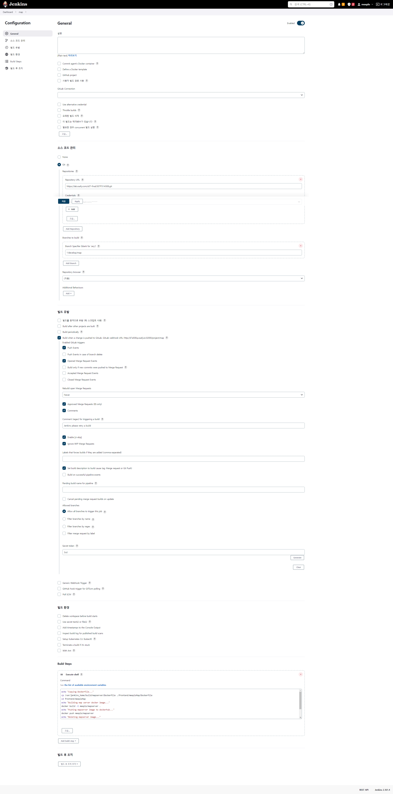

<details>
<summary>Execute shell 내용</summary>

```bash
echo "Copying Dockerfile..."
cp /var/jenkins_home/build/mapserver/Dockerfile ./frontend/meeploMap/Dockerfile

cd frontend/meeploMap

echo "Building map server docker image..."
docker build -t meeplo/mapserver .

echo "Pushing mapserver image to dockerhub..."
docker push meeplo/mapserver

echo "Deleting mapserver image..."
docker images -f reference="meeplo/mapserver:latest" -q && docker rmi $(docker images -f reference="meeplo/mapserver" -q)

echo "Restarting deployment..."
kubectl rollout restart deployment map-server -n map
```

</details>

</details>

# 2. 외부 서비스

## 1. Kakao Social Login

### - 어플리케이션 등록

### - Client

- `@react-native-seoul/kakao-login` 라이브러리 사용

1. 설치

   ```bash
   yarn add @react-native-seoul/kakao-login
   ```

2. 안드로이드용 설정

- `AndroidManifest.xml` 에 추가

  ```xml
  <activity
    android:name="com.kakao.sdk.auth.AuthCodeHandlerActivity"
    android:exported="true">
    <intent-filter>
        <action android:name="android.intent.action.VIEW" />
        <category android:name="android.intent.category.DEFAULT" />
        <category android:name="android.intent.category.BROWSABLE" />

        <!-- Redirect URI: "kakao{NATIVE_APP_KEY}://oauth“ -->
        <data android:host="oauth"
            android:scheme="kakao{카카오 네이티브 앱 key}" />
    </intent-filter>
  </activity>
  ```

- `app/src/main/res/values/strings.xml`에 추가
  ```xml
  <resources>
      <string name="app_name">KakaoLoginExample</string>
      <string name="kakao_app_key">{카카오 네이티브 앱 key}</string>
  </resources>
  ```

### - Backend

- backend에서는 직접 로그인을 하는 것이 아닌, 로그인 하여 받은 토큰 정보를 바탕으로 카카오에서 회원 정보를 조회에 오는데만 사용하기 때문에 REST API 키를 사용하여 kakao 서버에 요청을 보낸다.

  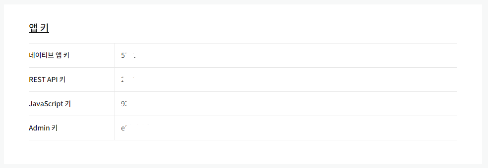

  ```yaml
  # 백엔드의 application.yml파일의 해당 코드에 가져온 키를 입력한다.
  kakao:
    restapikey: { REST API 키 }
  ```

## 2. Kakao Map

**주소로 좌표 검색, 좌표로 주소 변환 api 사용**

- API Key 등록 : Kakao developers에서 개인 앱을 등록한후 앱 키 중 REST API키를 가져온다.

  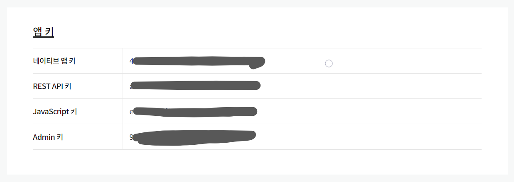

- Backend의 설정은 위와 동일
- 관련 링크
  [Kakao Developers](https://developers.kakao.com/docs/latest/ko/local/dev-guide#coord-to-address)

## 3. OpenRouteService

**경로를 파악하는 api를 제공**

- /v2/directions/{profile}/json api를 사용

### - API Key 등록

- 로그인 후 token type와 token name을 설정한 후 create token으로 생성

  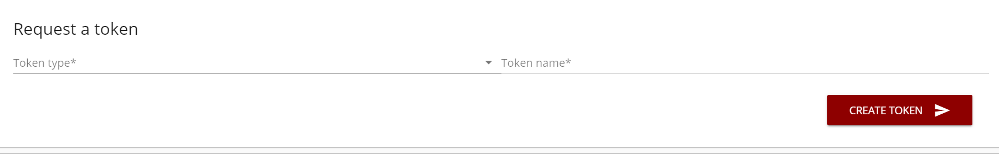

### - Backend 설정

```yaml
OpenRouterService:
  api_key: { API_KEY }
```

### - 관련링크

[Dashboard | ORS](https://openrouteservice.org/dev/#/api-docs/directions)

## 4. S3

bucket 생성 - region은 아시아 태평양(ap-northeast2) 로 생성

public access 허용해야 RN에서 접근 가능한 것으로 보임.

IAM 대시보드에서 사용자 meeplo 생성 → `AmazonS3FullAccess` 부여
