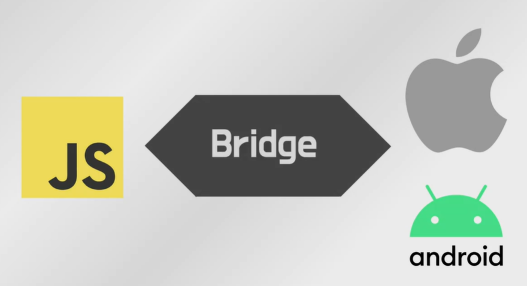
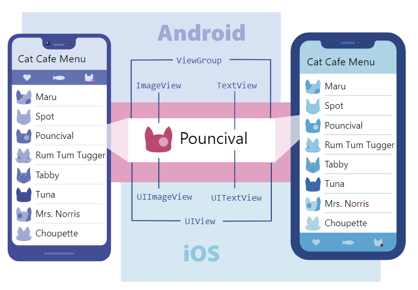
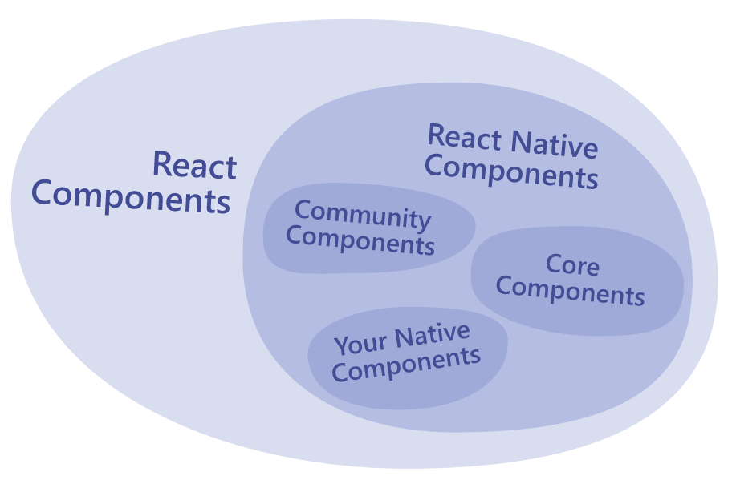

# 처음으로 배우는 React Native


## 환경 설정


### Android

* JDK 설치
  * React Native 공식홈페이지에서 `Chocolatey`를 이용한 설치를 권장
* Android Studio 설치
* 환경변수 설정


## 리액트 네이티브란?

### 1. 리액트 네이티브

* 페이스북에서 만든 오픈소스 프로젝트
* JS를 이용해서 iOS, Android 모바일 애플리케이션을 만들 수 있다.
  * ex) 페이스북, 인스타그램 등..


#### 장점

1. 쉬운 접근성 (JS)
   * 리액트를 이용한 개발 경험이 있다면, 더 쉽게 할 수 있음
2. 비용 절감
3. Fast Refresh
   * 코드 수정에 따른 결과를 바로 확인할 수 있음

#### 단점

1. 네이티브 앱과의 성능 차이가 존재
   * 하이브리드보다는 좋지만 네이티브앱 보다는 성능이 낮음
   * 코딩을 조금만 잘못해도 차이가 눈에 띄게 드러남
   * 새로운 기능이 나왔을 때, RN에서 지원하지 않으면 사용 불가
2. 디버깅
   * 명확한 문제를 알기 어려움ㅠ


### 동작 방식



> JS로 작성된 코드 -> iOS / Android로 작동된다.
>
> Bridge: JS thread에서 Native thread로 전달하는 역할 (일종의 통신 담당)
>
> 지금 RN에서는 TuboModules로 전환 중.. Bridge에 의존하지 않고 효율적으로 통신하려 한다. 


> 가상 돔으로 인해 데이터가 변경되었을 때 가상 돔에 변경사항이 적용되어서, 실제 돔과 비교해서 실제 돔의 변경이 필요한 부분을 확인
>
> 변경이 필요한 부분을 가상 돔과 같게 변경을 한다. 


---

## Core Components and Native Components

> React Native에서 components가 어떻게 동작하는가?

* 리액트 네이티브는 리액트와 앱 플랫폼의 네이티브 기능을 이용하여 안드로이드와 iOS 애플리케이션을 제작하는 오픈소스 프레임워크이다.


### Views and mobile development

* `view`: UI의 기초 빌딩 블록으로, 텍스트나 이미지를 보여주거나 사용자 input에 반응하는 데에 사용될 수 있는 작은 사각형 요소
* 한 줄 텍스트나 작은 버튼마저도 `view`라고 볼 수 있고, 일부 `view`는 다른 `view`에 속하기도 한다.




### Native Components

* 런타임에서, 리액트 네이티브는 컴포넌트들을 안드로이드와 iOS에 대응되는 `view`로 생성한다.
* 리액트 네이티브의 컴포넌트는 안드로이드와 iOS의 `view`로 뒷받침되기  때문에 리액트 네이티브 앱이 다른 애플리케이션과 비슷하게 보이고 동작할 수 있다. 
* **이러한 platform-backed components (플랫폼 바탕의 컴포넌트)를 Native Components라고 한다.**

* 그리고 리액트 네이티브에서는 오늘날 어플을 제작하기 위해 사용될 수 있는 필수적이고 ready-to-use인 Native Components의 셋을 제공하는데, 이것을 리액트 네이티브의  ready-to-use라고 한다.


### Core Components

> 리액트 네이티브에서 제공되는 Core Components는 공식 문서의 API section에서 확인 가능><


| REACT NATIVE UI COMPONENT | ANDROID VIEW   | IOS VIEW         | WEB ANALOG              | DESCRIPTION                                                  |
| :------------------------ | :------------- | :--------------- | :---------------------- | :----------------------------------------------------------- |
| `<View>`                  | `<ViewGroup>`  | `<UIView>`       | A non-scrolling `<div>` | A container that supports layout with flexbox, style, some touch handling, and accessibility controls |
| `<Text>`                  | `<TextView>`   | `<UITextView>`   | `<p>`                   | Displays, styles, and nests strings of text and even handles touch events |
| `<Image>`                 | `<ImageView>`  | `<UIImageView>`  | ``                 | Displays different types of images                           |
| `<ScrollView>`            | `<ScrollView>` | `<UIScrollView>` | `<div>`                 | A generic scrolling container that can contain multiple components and views |
| `<TextInput>`             | `<EditText>`   | `<UITextField>`  | `<input type="text">`   | Allows the user to enter text                                |


> 리액트 네이티브는 리액트 컴포넌트와 동일한 API 구조를 사용하기 때문에, 리액트 컴포넌트를 이해하는 것이 필요하다.




---

## Platform Specific Code

### `Platform` 모듈

* 리액트 네이티브에서 제공되는 모듈, 현재 앱이 구동되고 있는 플랫폼을 파악한다.


#### `Platform.OS`

* 현재 동작되고 있는 OS를 파악하는 코드


#### `Platform.select`

* 아래 예시의 키를 가진 객체가 주어지면 현재 실행 중인 플랫폼에 가장 적합한 값을 반환하는 메서드
  * `ios `, `android`, `native`, `default`

* 폰에서 실행 중이면, `ios` 혹은 `android`가 우선되고,
  특정되지 않으면 `native` 그 다음이 `default`가 된다.

```react
import { Platform, StyleSheet } from 'react-native';

const styles = StyleSheet.create({
  container: {
    flex: 1,
    ...Platform.select({
      ios: {
        backgroundColor: 'red'
      },
      android: {
        backgroundColor: 'green'
      },
      default: {
        // other platforms, web for example
        backgroundColor: 'blue'
      }
    })
  }
});
```


#### `Platform.Version`

* Detecting the Android or iOS version
* 안드로이드 버전
  * `Plarform.Version === 31`
* iOS 버전
  * `parseInt(Platform.Version, 10) <= 9`


### Platform-specific extensions

* 코드가 복잡해지면, 플랫폼에 따라 파일을 분리할 수 있다.
* 리액트 네이티브는 파일이 `.ios.` 혹은 `.android.`를 갖고 있는지를 감지하고, 해당 플랫폼에 맞게 로딩해준다.

```react
// BigButton.ios.js
// BigButton.android.js
import BigButton from './BigButton';
// 이렇게 하면, 자동으로 플랫폼에 맞는 파일을 불러와준다.
```

